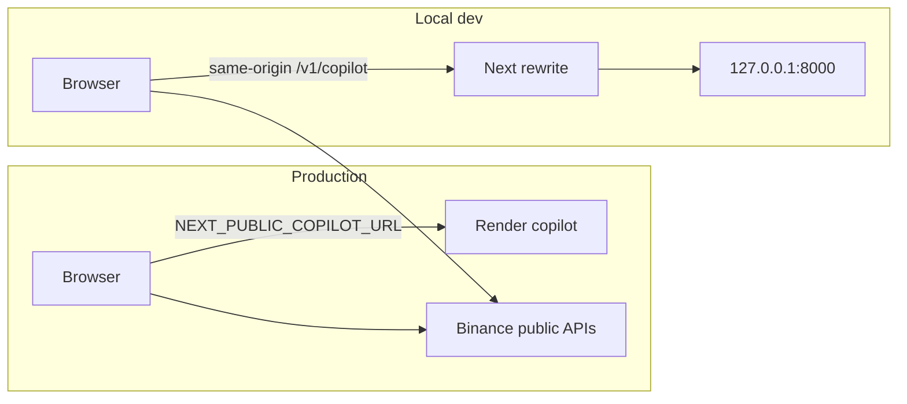

# Deploy `apps/web` to Vercel

### BLUF

**Deploy the Next.js chart UI on Vercel with Root Directory `apps/web`.** In production, the browser calls the public Render copilot via `NEXT_PUBLIC_COPILOT_URL`; local dev keeps same-origin rewrites to `127.0.0.1:8000` when that variable is unset or empty.

### Key metrics & actions

- **Prerequisites:** Vercel project linked to this repo; Render copilot URL from `apps/copilot` (teammate-owned).
- **Breaking changes:** None for local dev. Vercel **must** set `NEXT_PUBLIC_COPILOT_URL` or copilot calls will not reach Render.
- **Primary commands:** `cd apps/web && pnpm install && pnpm build` (Vercel runs equivalent on push).

### Vercel project settings

| Setting | Value |
|---|---|
| Root Directory | `apps/web` |
| Framework | Next.js (auto-detected) |
| Install Command | `pnpm install` (default) |
| Build Command | `pnpm build` (default) |
| Output | Standard Next.js (do **not** use `output: 'export'`) |

No `vercel.json` is required for the default App Router deploy.

### Environment variables (Vercel → Production & Preview)

| Variable | Required on Vercel | Example | Notes |
|---|---|---|---|
| `NEXT_PUBLIC_COPILOT_URL` | **Yes** (prod) | `https://your-service.onrender.com` | HTTPS origin only; no path suffix. Client calls `{origin}/v1/copilot/*` including SSE `POST …/analyze`. |
| `COPILOT_UPSTREAM_URL` | No | — | Ignored when `NEXT_PUBLIC_COPILOT_URL` is set; rewrites are disabled in that case. |

**Do not** set `LLM_*` or any provider keys on Vercel — keys stay on Render (`apps/copilot`).

### Local / dev (unchanged)

| Variable | Example | Behavior |
|---|---|---|
| `NEXT_PUBLIC_COPILOT_URL` | *(empty or omitted)* | Browser uses same-origin `/v1/copilot/*`. |
| `COPILOT_UPSTREAM_URL` | `http://127.0.0.1:8000` | Next rewrites those paths to local FastAPI. |

Optional tunnel: run copilot + web with `scripts/dev-stack.sh`; ngrok on port 3000 is supported via `allowedDevOrigins` in `next.config.ts`.

### CORS (Render — copilot owner)

The copilot must allow the Vercel frontend origin in `COPILOT_CORS_ORIGINS` on Render (e.g. `https://your-app.vercel.app`). Without this, browser `fetch` and SSE to Render fail with CORS errors. Chart/market data still works (Binance is called directly from the browser).

### SSE / timeouts

- Analyze uses **browser → Render** `fetch` with `Accept: text/event-stream` and reads the response body on the client. Vercel does not proxy that stream when `NEXT_PUBLIC_COPILOT_URL` is set.
- Long analyses depend on **Render** request timeouts and **LLM** latency, not Vercel function limits.
- Render free tier may sleep; first request after idle can be slow or fail until the service wakes.

### Technical specification

**Request routing**

Implementation: `apps/web/lib/use-copilot.ts` (`resolveBaseUrl`) and `apps/web/next.config.ts` (rewrites only when `NEXT_PUBLIC_COPILOT_URL` is empty/unset).
