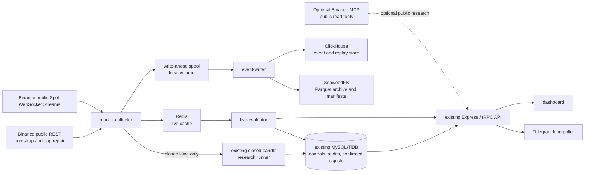

# CryptoSignal Public Binance Real-Time Data Architecture

## 1. Decision Summary

CryptoSignal will add a **self-hosted, public-market-data subsystem** for the existing BTC/USDT, ETH/USDT, and BNB/USDT watchlist. The subsystem will ingest official Binance Spot WebSocket market streams, provide live dashboard updates and clearly labelled unconfirmed observations through both the dashboard and Telegram, and retain durable raw data for replay, backtesting, chart overlays, and later model evaluation.

The design deliberately preserves the application’s existing signals-only boundary. It will not use Binance private account, trading, transfer, wallet, or order endpoints. It will not store exchange API keys or secrets. It will not place, amend, cancel, or simulate orders. A live observation is not a confirmed signal and cannot be presented as a trade recommendation.

| Decision | Selected approach | Reason |
|---|---|---|
| Continuous source | Official Binance Spot WebSocket Streams | Event-driven public updates are the documented source for aggregate trades, best bid/ask, depth, and live candles. [1] |
| Agent/research interface | Binance MCP, public-read-only, optional | MCP may expose public market reads without authentication; it is not the continuous transport and every private or action tool remains disabled. [2] |
| Live cache | Self-hosted Redis | Separates low-latency latest-state reads from durable ingestion and replay queries. |
| Replay/query store | Self-hosted ClickHouse | Column-oriented event storage and materialized views suit continuously inserted analytical data. [3] |
| Canonical archive | Self-hosted SeaweedFS with Parquet objects | Apache-2.0 licensed local S3-compatible archive with a simple single-node entry point and an expansion path. [4] |
| Existing transactional store | Existing MySQL/TiDB | Retains bot controls, user-facing audits, confirmed snapshots, alert state, and configuration. |
| Deployment | Docker Compose profiles on local machine or VPS | Every required component is deployable with the repository; no managed cloud dependency is required. |

> **Scope boundary.** The words *real-time*, *live*, and *observation* describe the freshness of public market data. They do not change CryptoSignal into an execution system, a brokerage interface, or a source of personalized financial advice.

## 2. Product Outcomes and Non-Goals

The first delivery serves three outcomes. The dashboard should visibly update with the current public market state for the three approved symbols. The system should retain raw public events and derived bars long enough to replay the market as it was observed. Finally, it should identify selected live conditions and deliver them through the dashboard and Telegram as **unconfirmed observations**, governed by their own controls.

| In scope | Explicitly out of scope |
|---|---|
| BTC/USDT, ETH/USDT, BNB/USDT public Spot streams | Binance account, balance, position, transfer, or user-data streams |
| Aggregate trades, best bid/ask, selected candle updates, and optional depth deltas | Order placement, cancellation, amend, conversion, margin, futures execution, or paper trading |
| A two-year minimum durable retention design | Private keys, exchange API keys, client trading credentials, or Agentic sub-account creation |
| Dashboard and Telegram live-observation alerts | Replacing confirmed closed-candle methodology or implying an open candle is confirmed |
| Replay APIs, charts, and deterministic backtest inputs | Claims of predictive accuracy, investment suitability, or individualized recommendations |
| An optional, public-read-only MCP adapter | MCP as the high-throughput stream transport or a required runtime dependency |

## 3. Source and Transport Policy

### 3.1 Binance WebSocket streams are the production data plane

The collector will subscribe to Binance’s public combined Spot WebSocket stream endpoint. The documented stream surface includes real-time aggregate trades and best bid/ask updates, diff-depth updates, and current kline updates. Kline payloads include the `x` flag that identifies a closed candle. [1] The collector will use this flag only to hand a completed candle into the established confirmed-research pipeline.

The initial subscription bundle is intentionally narrow. It limits volume, operational risk, and replay complexity while still supporting price, spread, transaction flow, and candle-driven observations.

| Stream | Initial status | Durable raw retention | Primary use |
|---|---|---:|---|
| `{symbol}@aggTrade` | Enabled | Yes | Trade-flow, price, and volume observations |
| `{symbol}@bookTicker` | Enabled | Yes | Best bid/ask, spread, and quote freshness |
| `{symbol}@kline_30m`, `@kline_1h`, `@kline_4h` | Enabled | Yes | In-progress visual context and closed-candle handoff |
| `{symbol}@depth@1000ms` | Deferred profile | Pilot decision | Depth imbalance research after sequence-recovery testing |
| All-symbol tickers and arbitrary symbols | Excluded | No | Prevent uncontrolled storage growth |

The public REST kline endpoint remains the gap-repair and historical-bootstrap source. It is not a substitute for live streaming. The collector must reconnect with exponential backoff, react to connection closure, respond to ping/pong requirements, and account for the documented 24-hour connection lifetime. [5]

### 3.2 Binance MCP is an optional read-only research plane

Binance’s Agent OS announcement identifies the MCP endpoint as `https://agent.binance.com/mcp/agentic` and states that public market-data reads—including tickers, order books, candlesticks, and funding rates—need no authentication. It separately describes private balance, trading, and transfer scopes. [2] CryptoSignal will treat the MCP server as an optional operator or agent research interface, not as a required service dependency.

The MCP adapter will use an allowlist of public read tools only. The process will reject tool identifiers associated with account data, trading, transfers, or configuration mutation, even if a future MCP catalog exposes them. It will run without Binance credentials. A failure of the MCP adapter must never interrupt the WebSocket collector, cache, archive writer, confirmed-candle runner, or Telegram poller.

| MCP rule | Required behavior |
|---|---|
| Authentication | Do not request, persist, or pass credentials for public market reads. |
| Tool allowlist | Only public ticker, order-book, candle, exchange-information, and comparable read operations after contract verification. |
| Tool denylist | All balance, position, transfer, wallet, order, trade, conversion, margin, futures-account, and write operations. |
| Audit | Record tool name, normalized public parameters, latency, result status, and no secret-bearing payload. |
| Failure mode | Return a degraded optional-research state; do not fall back to private endpoints. |

## 4. Architecture

### 4.1 Component responsibilities

Each service has one bounded responsibility. The collector never evaluates user alert preferences; the evaluator never assumes an incoming event is archived; and the archive writer does not serve dashboard latency-critical reads. This boundary prevents a slow archive disk or a Telegram outage from dropping live market input.

| Component | Responsibility | Reads | Writes | Must not do |
|---|---|---|---|---|
| `market-collector` | Connect, validate, normalize, sequence, reconnect, and spool public Binance events | WebSocket, REST repair | Redis, local spool, health/audit | Analyze patterns, send alerts, access private scopes |
| `event-writer` | Batch normalized spool records, verify archive writes, and persist queryable data | Local spool | ClickHouse, SeaweedFS, manifests | Mutate live cache or alert users |
| `live-evaluator` | Compute selected open-candle and microstructure observations from cached state | Redis, control config | Live observation/audit records | Call confirmed signal APIs or write closed-candle snapshots |
| `closed-candle runner` | Preserve existing closed-candle analysis and confirmed-pattern behavior | Completed candles only | Existing candle history and snapshots | Read open-candle conditions as confirmation |
| `mcp-research-adapter` | Execute allowlisted public MCP research calls on demand | Optional MCP endpoint | Public research audit | Replace streaming or invoke prohibited tools |
| API/dashboard | Serve current view, replay queries, controls, audit and health | Redis, ClickHouse, MySQL/TiDB | Control state only | Directly subscribe browser clients to Binance |
| Telegram poller | Deliver controls and messages through long polling | API/control state | Audits, outgoing message state | Receive webhooks or create trading actions |

### 4.2 Local durability path

Before acknowledging an incoming normalized event as accepted, the collector appends it to a rolling local write-ahead spool. The spool uses newline-delimited records with an envelope containing schema version, event ID, ingestion time, exchange event time, source stream, symbol, payload hash, and payload. Files rotate on a bounded size and time schedule.

The writer batches spool records into ClickHouse and time-partitioned Parquet objects. A Parquet object becomes durable only after the SeaweedFS upload is verified through checksum and its corresponding manifest is committed. Spool segments are deleted only after both the analytical-store acknowledgement and archive-manifest verification succeed. On restart, replay begins from the oldest verified-uncommitted spool record.

This is a deliberate **at-least-once ingest** design. Every consumer must use deterministic event identities and idempotent inserts. The design accepts occasional duplicate delivery from transport/reconnect behavior rather than silently losing data.

## 5. Data Contracts and Retention

### 5.1 Normalized event envelope

All durable streams use the same envelope so replay can preserve provenance and tolerate source-schema evolution.

| Field | Meaning |
|---|---|
| `event_id` | Deterministic identifier from venue, stream, symbol, source sequence or source timestamp, and payload hash |
| `schema_version` | Versioned normalized-event contract |
| `venue` | `BINANCE_PUBLIC` |
| `stream_type` | `AGG_TRADE`, `BOOK_TICKER`, `KLINE_UPDATE`, or later `DEPTH_DELTA` |
| `asset_symbol` | Canonical application symbol such as `BTC/USDT` |
| `exchange_event_time` | UTC exchange timestamp where supplied |
| `ingested_at` | UTC collector receipt timestamp |
| `is_closed_candle` | Valid only for a kline event; mirrors the documented closure flag |
| `payload` | Lossless normalized raw fields, preserving numeric values as strings where precision requires it |
| `source_connection_id` | Collector connection generation for outage and replay analysis |
| `integrity_hash` | Hash of canonical serialized payload |

The relational control store continues to contain user configuration, confirmed snapshots, candle history, system audit events, and runner health. It must not become the raw high-frequency event store.

### 5.2 Storage layout and retention policy

The archive adopts a day-and-symbol partition scheme: `market-events/venue=binance-public/stream={stream}/symbol={symbol}/date=YYYY-MM-DD/hour=HH/`. Objects are Parquet files accompanied by immutable manifest records. The manifest names expected count, first and last exchange time, source connection generations, content checksum, schema version, and the ClickHouse batch marker.

| Tier | Technology | Retention target | Query purpose | Operational rule |
|---|---|---:|---|---|
| Hot | Redis | Short bounded window | Dashboard latest quote, rolling observation inputs, low-latency condition evaluation | Eviction is acceptable; cache is reconstructable from stream/spool |
| Warm | ClickHouse local volumes | At least recent replay window, initially 90 days | Dashboard replay, chart overlays, live diagnostics, aggregate backtests | Partition by date and stream; use materialized views for bars/rollups |
| Canonical | SeaweedFS Parquet archive | Minimum two years | Full replay, backtest inputs, export, recovery of warm tier | Verify immutable manifest before spool deletion |
| Control | Existing MySQL/TiDB | Operational history | Config, audit, alert dedupe, health, confirmed signals | Do not store raw feed payloads at stream rate |

The two-year requirement is a durability target, not a claim that a fixed disk allocation will fit all possible future stream rates. Aggregate trades and best-bid/ask updates vary materially with market activity. The first pilot must measure event count, compressed Parquet bytes, ClickHouse compression ratio, ingestion lag, and query latency for every selected stream before a production storage allocation is finalized.

## 6. Live Observation and Confirmed Research Policy

### 6.1 Two mutually exclusive data-quality states

The live evaluator uses an explicit `LIVE_UNCONFIRMED` data-quality state. It is restricted to observations based on still-forming candles, recent aggregate-trade flow, best bid/ask spread, or other nonfinal public data. A completed candle handed over by the collector becomes eligible for the existing closed-candle path only when Binance marks the kline as closed and the normal close-time guard accepts it.

| Property | Live observation | Confirmed research signal |
|---|---|---|
| Input | In-progress public events and open candles | Completed candles only |
| Data-quality label | `LIVE_UNCONFIRMED` | `PUBLIC_CLOSED_CANDLES` or Freqtrade equivalent |
| Persistence | Live observation records plus archival raw data | Existing snapshots and candle history |
| Alert text | “Unconfirmed live market observation” | “Confirmed closed-candle research observation” |
| Controls | Separate live enabled flag, selected conditions, threshold, cooldown, quiet hours | Existing confirmed controls, rule families, named patterns, threshold, cooldown |
| Cross-over rule | Cannot create/modify confirmed state | Cannot treat an earlier live observation as confirmation |

### 6.2 Initial live-condition families

The initial catalog must remain small and explainable. Each condition has deterministic evidence, a unit-tested evaluator, and an owner-visible enable/disable toggle. Pattern methodology requiring candle closure remains solely in the confirmed path.

| Family | Initial observation | Evidence shown to user | Default |
|---|---|---|---|
| Price movement | Short-window percentage displacement | Window, previous price, current price, percentage change | Disabled |
| Spread | Best bid/ask spread widening or tightening | Bid, ask, absolute and basis-point spread | Disabled |
| Trade flow | Aggregate-trade notional or buyer/seller imbalance anomaly | Window, count, notional, signed ratio | Disabled |
| Open-candle threshold | In-progress move beyond configurable ATR/percentage guard | Timeframe, provisional OHLCV, reference threshold | Disabled |
| Feed quality | Stale quote, stream reconnect, sequence gap, or writer lag | Last event time, gap range, affected stream | Enabled for operators, not market alert recipients |

Every market-facing notification must include: symbol, data time, condition label, numeric evidence, “unconfirmed” status, research-only disclaimer, cooldown reason when suppressed, and a link or route to the associated dashboard state. Telegram must retain long polling; no webhook will be introduced.

## 7. Reliability, Recovery, and Security

### 7.1 Failure handling

| Failure | Detection | Immediate behavior | Recovery and audit |
|---|---|---|---|
| WebSocket disconnect | Close event, missed heartbeat, stale event timer | Mark collector degraded; retain cache with freshness marker; do not synthesize events | Reconnect with bounded exponential backoff; REST repair where possible; audit gap interval |
| 24-hour connection expiry | Connection-age timer | Planned reconnect before documented lifetime | Rotate connection and record generation boundary [5] |
| Sequence gap for depth profile | Update-ID discontinuity | Quarantine derived depth condition evaluation | Fetch snapshot, resume only after documented sequence alignment, audit loss range |
| Redis unavailable | Cache write/read failure | Collector continues durable spool; live observations pause safely | Rebuild latest cache from stream/spool and emit health recovery |
| ClickHouse unavailable | Batch failure/lag | Preserve spool, stop acknowledging write batches | Retry idempotently; show queue age and backlog |
| SeaweedFS unavailable | Archive verification failure | Preserve spool and ClickHouse batch marker; do not delete segment | Retry and alarm on archive lag; block retention purge |
| Telegram delivery failure | Send error | Do not recompute or duplicate condition | Record outcome, retry according to idempotency/delivery policy |
| MCP unavailable/contract changes | Tool or transport error | Mark optional research adapter unavailable | Continue normal system; audit denied/failed tool call |

### 7.2 Security controls

All services run on an internal Docker network by default. SeaweedFS, Redis, and ClickHouse ports are not published to the public interface. The dashboard/API is the only internet-facing application component and remains protected by its existing access surface. Local persistent volumes must be host-permission restricted and included in host backup procedures.

No service has a Binance API key, API secret, account credential, or private scope. The public Binance URLs are allowlisted. The MCP adapter only accepts the approved endpoint and tool allowlist. Logging must redact authorization headers defensively, even though the public path is designed to run without them.

## 8. Docker Compose Deployment Topology

The current Compose deployment will be extended rather than replaced. Each new service is profile-gated so development dashboards can run without persistent ingestion components.

| Compose profile | Services | Intended use |
|---|---|---|
| Default | `web` | Existing dashboard and control API |
| `market-live` | `market-collector`, `redis`, `live-evaluator` | Live dashboard and unconfirmed observations |
| `market-retain` | `event-writer`, `clickhouse`, `seaweedfs` | Durable replay and archive pipeline |
| `telegram` | Existing `poller` | Telegram long polling delivery and control |
| `mcp-research` | `mcp-research-adapter` | Explicit opt-in public MCP research only |
| `ops` | Optional dashboard/metrics exporter only after service need is validated | Local observability expansion |

The planned production guide will document local and VPS deployment as the same Compose topology, changing only persistent volume location, backup destination, network exposure, and host TLS proxy configuration. It will not require Kubernetes, a managed cloud service, or a proprietary event broker.

## 9. Superpowers Skill Vendor Strategy

The user requested the upstream `obra/superpowers` skills be included in the repository. The upstream directory presently contains fourteen skill packages, including brainstorming, planning, execution, testing, debugging, worktree, review, and verification guidance. [6] The source revision observed during this review was `b36e0829c6d0140e93cfef2ca599b1b07d4a7797`.

The implementation will vendor the source packages under `skills/superpowers/` only after this specification is approved. The vendor operation will record the upstream repository URL, immutable commit, license, import date, package inventory, and a review manifest. Imported material remains reference guidance; it cannot override this repository’s signals-only policy, public-data boundary, secret handling, deployment rules, or the governing agent instructions.

| Vendor safeguard | Required action |
|---|---|
| Provenance | Record upstream URL, commit hash, original license, and file hashes in `skills/superpowers/UPSTREAM.md`. |
| Review | Inspect all imported `SKILL.md` files before enabling any repository workflow reference. |
| Isolation | Do not execute upstream scripts automatically. Treat scripts as untrusted until explicitly reviewed. |
| Update policy | Upgrade only through a diff review against the recorded pinned revision. |
| Repository safety | Keep vendored material separate from application runtime, Docker images, and production secrets. |

## 10. Staged Delivery Plan

This document is a design baseline. Each phase has a reviewable completion criterion and must preserve the no-private-data/no-execution constraints.

| Phase | Deliverable | Completion gate |
|---|---|---|
| 0. Contract and capacity spike | Validate public stream payload contracts, measure a bounded pilot, confirm local disk and network needs, and write executable schema fixtures | No credentials; raw event samples and capacity report reviewed |
| 1. Local foundations | Compose profiles, Redis, ClickHouse, SeaweedFS, local volumes, health contracts, and backup/restore runbook | Services start locally; no Binance connection enabled by default |
| 2. Collector and spool | Public WebSocket collector, normalized event envelope, reconnect logic, spool recovery, REST bootstrap/repair | Fault-injection test shows no unaccounted durable-event loss within test scope |
| 3. Durable storage and replay | Idempotent ClickHouse ingestion, Parquet archive writer, SeaweedFS manifests, replay reader, retention jobs | A recorded window is replayed deterministically and archive checksum verification passes |
| 4. Live user surfaces | Redis-backed dashboard live view, live controls, dual dashboard/Telegram alerts, audit and cooldown isolation | Every live message is labelled unconfirmed; confirmed pipeline regression suite passes |
| 5. Optional MCP adapter | Public-tool allowlist, denied-tool tests, contract monitor, operator research UI/commands | No credentials or private tool calls; failure does not affect collector |
| 6. Skill vendor and documentation | Pinned, licensed, reviewed `skills/superpowers/` copy and maintenance guide | Source manifest and file-diff review complete |
| 7. Operational hardening | Backup restore drill, disk-full drill, reconnect soak test, replay acceptance test, alert suppression test | Owner accepts reliability evidence before broader watchlist expansion |

## 11. Test and Acceptance Strategy

Tests will use captured public fixtures and local fake WebSocket servers. The suite must never rely on a live private account, a funded sub-account, exchange credentials, or an order endpoint. Integration tests will run with Docker profiles in an isolated local network.

| Area | Acceptance evidence |
|---|---|
| Collector contract | Fixture parsing for every enabled stream; rejection of unknown/malformed events; canonical symbol mapping |
| Reconnect and repair | Controlled close, stale feed, reconnect, and REST repair tests with audited connection generations |
| Durability | Restart while writer is unavailable; spool replays idempotently; checksum manifest matches Parquet object |
| Replay | Identical event archive produces identical normalized replay ordering and deterministic derived bars |
| Live/confirmed split | Open kline cannot produce a confirmed snapshot; closed kline enters confirmed pipeline exactly once |
| Alert controls | Separate thresholds/cooldowns work independently; every live message contains unconfirmed/research-only text |
| Security | Tool-denylist tests; no request contains Binance credentials; no private data or action route is reachable |
| Operations | Container health, queue lag, archive lag, stale cache, disk pressure, and Telegram outcome are visible in audit/health UI |

## 12. Open Decisions Deferred to the Capacity Pilot

The following decisions are intentionally deferred until measured public-stream behavior is available. They are not blockers for approving the architecture, but they prevent the design from inventing unverified throughput or cost figures.

| Decision | Pilot measurement that determines it |
|---|---|
| Whether to activate the depth-delta profile | Stream event rate, sequence-repair reliability, compression ratio, and observation value |
| Warm ClickHouse retention duration | Disk utilization, replay query latency, archive restore time, and observed data rate |
| Archive Parquet row-group and file rotation size | Upload overhead, replay scan cost, and local spool recovery time |
| Single-host versus replicated SeaweedFS | Host failure tolerance requirement, available disks/nodes, and restore test results |
| RAM/CPU allocation | Collector throughput, Redis memory profile, ClickHouse insert/query benchmark, and concurrent dashboard load |
| Future symbol additions | Retention headroom, public API quotas, and successful three-symbol soak-test evidence |

## 13. References

[1]: <https://developers.binance.com/en/docs/catalog/core-trading-spot-trading/api/ws-streams/~> "Binance Spot WebSocket Market Streams"
[2]: <https://www.binance.com/en/support/announcement/detail/07d45cdd3831498f8a4ff339031a8480> "Introducing Binance Agent OS"
[3]: <https://clickhouse.com/docs/get-started/use-cases/real-time-analytics> "ClickHouse: Real-time analytics"
[4]: <https://github.com/seaweedfs/seaweedfs> "SeaweedFS repository and documentation"
[5]: <https://developers.binance.com/en/docs/products/spot/web-socket-api> "Binance General WebSocket API Information"
[6]: <https://github.com/obra/superpowers/tree/main/skills> "obra/superpowers skill inventory"
