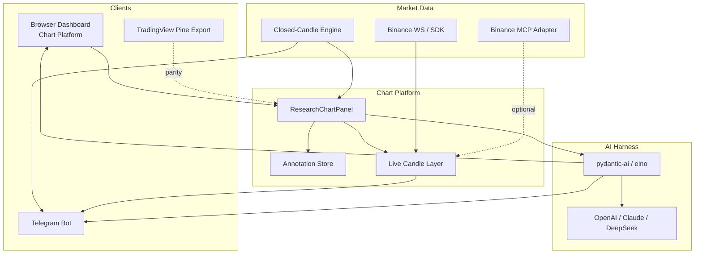

# Product Vision — CryptoSignal Platform Evolution

This document captures the **target product direction** and compares it to the **current implementation** as of September 2026. Use it when prioritizing features, restructuring code, or onboarding contributors.

> **Boundary (unchanged):** CryptoSignal remains a **signals-only market-research service**. No order placement, exchange private keys, portfolio tracking, or personalized trade recommendations.

## Target pillars

| Pillar | Intent |
|---|---|
| **Chart platform** | TradingView-like research surface where users and agents draw signals, trendlines, zones, and methodology overlays on canonical market context |
| **Realtime market data** | Live public Binance streams (MCP adapter or direct SDK/WebSocket) feeding chart updates and evaluators |
| **Telegram alerting** | Notify owners when configured rules or trend-break proxies fire; user verifies evidence on dashboard or TradingView export |
| **AI analysis harness** | Orchestrated agents (pydantic-ai / pydantic-graph / eino) that consume candle + signal + annotation context and produce structured research summaries via external model providers |

## Current state summary

CryptoSignal today is a **mature closed-candle research stack** with optional live observation, not yet a full chart-authoring or AI orchestration platform.

| Area | Status | What exists |
|---|---|---|
| Chart platform | **Partial** | Lightweight Charts OHLCV, indicator overlays, closed-candle signal markers, ephemeral horizontal levels; Pine Script export for external TradingView |
| Realtime data | **Strong (direct)** / **Weak (MCP)** | Binance public WebSocket collector, Redis cache, live evaluator, ClickHouse/SeaweedFS retention; MCP adapter is backend-only and disabled by default |
| Telegram | **Strong** | Long-polling bot, dual dashboard/Telegram controls, closed-candle + `LIVE_UNCONFIRMED` alert paths |
| AI harness | **Missing** | `invokeLLM` scaffold unused; no pydantic-ai, pydantic-graph, or eino integration |

See also: [`CURRENT_ARCHITECTURE.md`](CURRENT_ARCHITECTURE.md) for runtime boundaries and [`TRADINGVIEW_VISUALIZER.md`](TRADINGVIEW_VISUALIZER.md) for Pine parity.

## Methodology catalog (implemented)

Canonical rules live in `shared/signal-types.ts`:

- **Rule families:** TREND, MOMENTUM, VOLUME, CANDLE_PATTERN, WYCKOFF, SMC, ELLIOTT_EXPERIMENTAL
- **18 candle patterns** (Doji through Three Inside Up/Down)
- **9 methodology rules** (EMA trend, RSI+MACD, volume, Wyckoff spring/upthrust proxies, SMC BOS proxies, Elliott impulse proxies)

Scoring runs in:

- `engines/freqtrade/user_data/strategies/CryptoSignalStrategy.py` (runner, 5-minute cycle)
- `server/public-candle-refresh.ts` (dashboard on-demand refresh)

Live (unconfirmed) conditions: `PRICE_DISPLACEMENT_V1`, `SPREAD_ANOMALY_V1`, `TRADE_FLOW_IMBALANCE_V1`, `OPEN_CANDLE_THRESHOLD_V1`.

## Gap analysis vs target vision

### 1. Chart platform

| Target | Current gap |
|---|---|
| User/agent-drawn trendlines, zones, Fibonacci | Not implemented; only local horizontal levels |
| Persisted, synced annotations | Levels are browser-local state |
| Embedded TradingView Charting Library | Uses Lightweight Charts; TV is export-only via Pine |
| Live candle streaming on chart | Live data feeds monitor panel, not the chart series |
| Methodology overlays as drawable layers | Rules produce findings text/score, not chart geometry |

### 2. Realtime Binance data

| Target | Current gap |
|---|---|
| Primary MCP data path you configure | Direct WebSocket collector is production path; MCP is opt-in research stub |
| Unified chart + evaluator feed | Siloed: chart = closed history, live = separate panel |
| Tick-level or forming-candle chart | Open kline shown in live panel only |

### 3. Telegram alerting

| Target | Current gap |
|---|---|
| Trend-break alerts user can verify | Closed SMC BOS / Wyckoff proxies + live conditions; not user-drawn trend breaks |
| Rich alert context (chart snapshot, AI summary) | Text/evidence alerts only |

### 4. AI agent harness

| Target | Current gap |
|---|---|
| pydantic-ai / pydantic-graph orchestration | Absent |
| eino (Go) workers | Absent |
| Multi-provider routing (OpenAI, Claude, DeepSeek) | Legacy Forge env vars only, no callers |
| Agent loop: fetch → analyze → explain → alert | No orchestration; MCP/LLM/evaluator are isolated |

## Recommended evolution order

1. **Component restructure** — `components/charting/` module with typed annotation contracts and a `ResearchChartPanel` entry point (in progress). See [`superpowers/plans/2026-09-06-platform-component-restructure.md`](superpowers/plans/2026-09-06-platform-component-restructure.md).
2. **Persisted annotation layer** — Store drawings as first-class evidence linked to asset/timeframe/methodology; API + dashboard sync.
3. **Live → chart bridge** — Stream forming candles into chart with visual `LIVE_UNCONFIRMED` distinction; never overwrite confirmed signals.
4. **MCP integration** — Wire owner-configured Binance MCP as an alternate collector path behind existing denylist/confirmation guards.
5. **AI harness service** — New worker: input = signal snapshot + candles + annotations; output = structured research summary → dashboard + optional Telegram digest.
6. **Platform workspaces** — Extract dashboard workspaces from monolithic screens; unify Research/Live/Agent surfaces around the chart platform.

## Architecture target (high level)

## What not to change without explicit owner approval

- Signals-only boundary (no trading execution paths)
- `LIVE_UNCONFIRMED` must never create, suppress, or overwrite confirmed closed-candle signals
- Telegram long polling only (no webhooks) unless architecture decision changes
- Dashboard auth via `dashboard_credentials` / `dashboard_sessions` only through `server/dashboard-auth.ts`
- Single `getUpdates` consumer per bot token in deployed environments

## Related documents

| Document | Role |
|---|---|
| [`CURRENT_ARCHITECTURE.md`](CURRENT_ARCHITECTURE.md) | Today’s runtime design |
| [`DASHBOARD_EXPERIENCE.md`](DASHBOARD_EXPERIENCE.md) | Research workspace UX |
| [`TRADINGVIEW_VISUALIZER.md`](TRADINGVIEW_VISUALIZER.md) | External TradingView indicator |
| [`superpowers/plans/2026-09-06-platform-component-restructure.md`](superpowers/plans/2026-09-06-platform-component-restructure.md) | Phase 1 component restructure plan |
| [`AGENTS.md`](../AGENTS.md) | Engineering guardrails |
