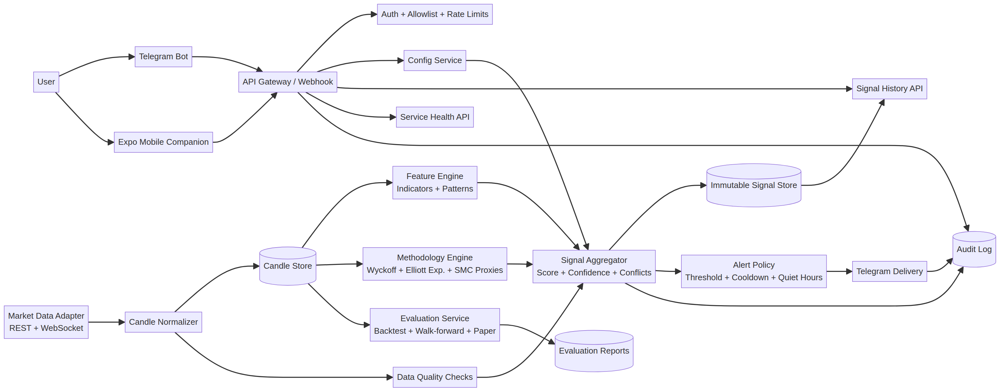

# CryptoSignal Telegram Bot

## Product Design and Implementation Blueprint

**Author:** Manus AI  
**Status:** Documentation-first design; no trading logic or order execution implemented  
**Reference date:** 18 August 2026, user timezone context  
**Safety boundary:** Signals, explanations, monitoring, paper evaluation, and configuration only. The first release must not place orders, hold exchange withdrawal permissions, or manage user funds.

> I am an AI, not a licensed financial advisor—this is analysis, not guaranteed advice; investing carries risk you bear. This document is a product and engineering blueprint, not a trading recommendation or performance guarantee.

## 1. Executive Summary

CryptoSignal is a mobile companion and Telegram-native control system for producing explainable technical-analysis signals from normalized OHLCV candles for liquid crypto assets such as BTC, ETH, BNB, SOL, and other user-approved symbols. The Telegram bot is the operational interface: users configure watchlists, timeframes, methodologies, alert thresholds, quiet hours, and delivery preferences in Telegram; the mobile app provides onboarding, health/status visibility, research summaries, configuration backup, and a read-only signal history view.

The system is intentionally differentiated from commercial platforms that emphasize autonomous trading, exchange connectivity, strategy marketplaces, copy trading, and broad no-code automation. Coinrule advertises visual conditions, indicator and time-based logic, backtesting, templates, and multi-venue automation [1]. Cryptohopper emphasizes customizable bots, DCA, trailing, arbitrage, copy trading, triggers, marketplace strategies, and third-party signals [2]. GoodCryptoX markets composite signals across 30+ centralized exchanges and Hyperliquid using moving averages and oscillators [3]. SYGNAL packages model-driven signals with standardized scores and auditability [4]. The proposed product should compete on a narrower but deeper promise: **transparent evidence, Telegram-first control, multi-timeframe confluence, versioned methodology rules, and reproducible signal history**.

The initial release should not attempt to make Wyckoff, Elliott Wave, or Smart Money Concepts into opaque predictive AI. It should expose each methodology as a bounded rule family that emits observable evidence, confidence, invalidation conditions, and data-quality warnings. Candlestick patterns should be treated as contextual features rather than stand-alone buy/sell commands. TA-Lib is a possible calculation primitive because it provides a BSD-licensed library with approximately 200 indicators and candlestick recognition [8], but each detector must be validated against a canonical internal test suite.

## 2. Goals, Non-goals, and Design Principles

### Goals

The product must ingest reliable OHLCV data, normalize symbols and timestamps, detect indicators and the requested candle patterns, generate a bounded bullish-to-bearish signal score, explain the evidence behind each signal, and deliver alerts through Telegram. It must support BTC, ETH, BNB, and a configurable asset registry; multiple timeframes; user-defined alert policies; paper-mode historical evaluation; and a complete audit trail.

The system must make it possible for a user to ask Telegram questions such as `/signal BTCUSDT 4h`, configure `/watchlist add ETHUSDT`, enable or disable pattern families, set a minimum score, request `/why`, and inspect prior signals. Configuration changes must be explicit, validated, versioned, and reversible.

### Non-goals for version 1

The first release will not place spot or derivatives orders, connect to private exchange account keys, calculate portfolio risk from user balances, promise profitability, provide individualized investment advice, or claim to identify actual institutional orders. It will not use an LLM as the source of truth for numerical calculations. Any future natural-language summary must be generated from a structured evidence object and must never override deterministic signal logic.

### Design principles

| Principle | Product implication |
|---|---|
| Explainability over prediction theater | Every signal contains rule IDs, raw measurements, candle timestamps, and invalidation criteria. |
| Closed-candle discipline | Signals are emitted only after a candle is closed unless the user explicitly enables provisional alerts. |
| Multi-timeframe context | A lower-timeframe trigger is qualified by higher-timeframe trend and regime state. |
| Configuration as data | Watchlists, thresholds, methodologies, and delivery rules are versioned entities, not hidden constants. |
| Research before automation | Backtest, walk-forward, paper mode, and out-of-sample checks precede any future execution feature. |
| Least privilege | No exchange withdrawal permission, no trading keys, and Telegram identity allowlists by default. |
| Honest uncertainty | Neutral, conflicting, stale, and insufficient-data states are first-class outcomes. |

## 3. Users and User Journeys

### Primary personas

The primary user is a technically curious discretionary trader who wants timely, explainable alerts without keeping a charting terminal open. A secondary user is a researcher who wants to compare rule families and review historical signals. An administrator or maintainer manages data-source credentials, bot deployment, detector versions, rate limits, and incident response.

### Onboarding journey

The user opens the Telegram bot, completes `/start`, and receives a privacy and risk notice. The bot verifies the Telegram user ID against an allowlist or creates a pending authorization record. The user selects a default quote currency, adds BTCUSDT and ETHUSDT, chooses 1h and 4h timeframes, and selects the Balanced profile. The bot confirms the resulting configuration in a review message with an explicit “Apply” action. The mobile app can display a QR/deep link to the bot, configuration status, last data refresh time, and recent signal history, but it is not required for operation.

### Signal-review journey

When a closed candle triggers a qualified condition, Telegram sends a compact alert. The alert includes asset, timeframe, direction, score, regime, trigger timestamp, top evidence, conflicting evidence, data quality, and a link to `/why <signal_id>`. The user can request `/chart <signal_id>` for a rendered image or `/explain` for the full evidence ledger. The bot must avoid imperative phrasing such as “buy now”; preferred phrasing is “bullish setup detected” or “bearish evidence detected.”

### Configuration journey

Users configure through guided commands and inline buttons. A wizard validates symbol names, supported timeframes, detector parameters, minimum confidence, cooldowns, quiet hours, and delivery targets. The bot shows a diff before applying changes and records the configuration version. A failed configuration is rejected without partially applying any fields.

### Research journey

The user requests `/backtest BTCUSDT 4h 2023-01-01 2025-12-31 profile=balanced`. The system queues a historical evaluation, reports progress, and returns metrics with a methodology version, data-source provenance, censor gap, fees/slippage assumptions, and warnings about overfitting. The result is explicitly labeled historical simulation and not a forecast.

## 4. Functional Requirements

| Area | Requirement | Priority |
|---|---|---:|
| Asset registry | Support BTC, ETH, BNB initially, with extensible exchange-symbol mappings and quote currencies. | P0 |
| OHLCV ingestion | Fetch historical candles and receive live kline updates from a public market-data adapter; normalize timestamps to UTC. | P0 |
| Data quality | Detect gaps, duplicates, out-of-order candles, abnormal volume, stale feeds, and exchange maintenance. | P0 |
| Indicators | EMA/SMA, RSI, MACD, ADX, ATR, Bollinger Bands, stochastic oscillator, ROC, volume moving averages, VWAP where source data permits. | P0 |
| Candle patterns | Implement all requested one-, two-, and three-candle patterns with context and confirmation rules. | P0 |
| Methodologies | Provide bounded Wyckoff, Elliott Wave experimental, and SMC proxy rule families. | P1 |
| Scoring | Emit bullish, bearish, neutral, conflict, or insufficient-data states with normalized score and confidence. | P0 |
| Telegram | Commands, inline keyboards, alert delivery, acknowledgements, rate limits, and allowlist controls. | P0 |
| Mobile app | Onboarding, bot-linking, configuration overview, signal history, health status, and documentation links. | P1 |
| Evaluation | Backtest, walk-forward, out-of-sample, paper mode, and rule-level attribution. | P1 |
| Auditability | Immutable signal snapshot, detector version, configuration version, source candle IDs, and delivery log. | P0 |
| Execution | Exchange order placement or private API keys. | Explicitly excluded |

## 5. Signal Methodology

### 5.1 Structured signal object

Every detector returns a `Finding` rather than a trade instruction. A finding contains `finding_id`, `rule_family`, `rule_id`, `direction`, `strength`, `timeframe`, `observed_at`, `candle_close_time`, `evidence`, `invalidation`, `data_quality`, and `detector_version`. Strength is bounded from -1 to +1, where negative means bearish evidence, positive means bullish evidence, and zero means neutral or non-directional.

The aggregator produces a `SignalSnapshot` containing the score, confidence, regime, evidence list, conflicts, data coverage, and the exact configuration/detector versions. A signal can be `BULLISH_SETUP`, `BEARISH_SETUP`, `NEUTRAL`, `CONFLICTED`, `DATA_STALE`, or `INSUFFICIENT_HISTORY`. The system must never collapse stale or conflicting evidence into a directional signal.

### 5.2 Core indicators

Indicators are grouped by role to reduce double-counting. Trend features include EMA/SMA slope, price relative to moving averages, MACD state, and ADX. Momentum features include RSI, stochastic, ROC, and divergence candidates. Volatility features include ATR, Bollinger bandwidth, and candle-range percentiles. Volume features include relative volume and OBV-like accumulation measures where volume semantics are reliable. Structure features include swing highs/lows, break of structure, support/resistance, and range position.

A default Balanced profile should cap the contribution of each role. For example, trend may contribute at most 30% of the score, momentum 20%, volatility 15%, volume 15%, candle patterns 10%, and methodology context 10%. These percentages are configuration defaults for research, not empirically proven weights. The implementation plan must include ablation tests to determine whether each family improves out-of-sample behavior.

### 5.3 Candlestick detector catalogue

| Family | Patterns | Required implementation behavior |
|---|---|---|
| Single-candle | Doji; Hammer; Inverted Hammer; Shooting Star; Hanging Man; Spinning Top | Measure body-to-range ratio, upper/lower shadow ratios, trend context, location relative to support/resistance, and optional volume confirmation. Do not emit directional evidence from shape alone when context is absent. |
| Two-candle | Bullish Engulfing; Bearish Engulfing; Bullish Harami; Bearish Harami; Tweezer Top; Tweezer Bottom | Validate body/range relationships, prior trend, equality tolerance for tweezer levels, and confirmation by the following closed candle when enabled. |
| Three-candle | Morning Star; Evening Star; Three White Soldiers; Three Black Crows; Three Inside Up; Three Inside Down | Validate sequence, body size progression, gaps where the venue/timeframe can represent them, close location, and trend context. |

StockCharts' pattern dictionary provides useful reference definitions: a doji has an open and close that are virtually equal; hammer and hanging-man shapes share a long lower shadow but differ by context; engulfing requires the second real body to engulf the first; and morning/evening stars are three-candle reversal structures [12]. The detector should preserve both the raw measurements and the contextual qualification so users can distinguish “shape observed” from “qualified reversal evidence.”

### 5.4 Wyckoff rule family

Wyckoff is implemented as a state machine over a rolling range and trend context, not as a single indicator. The first version identifies candidate trading ranges, tests relative volume and spread behavior, detects springs/upthrust-like events as observable price excursions followed by re-entry, and emits phase hypotheses such as `RANGE_EARLY`, `RANGE_TEST`, `MARKUP_CANDIDATE`, `DISTRIBUTION_CANDIDATE`, or `UNCLASSIFIED`.

The five-step Wyckoff framing—market position, harmony with the broader trend, cause, readiness to move, and timing—provides a useful decomposition for rule modules [10]. Each module must state what can be observed from OHLCV and what cannot. The system must not label an actor as “smart money”; it may say “range-and-volume behavior is consistent with an accumulation hypothesis.”

### 5.5 Elliott Wave experimental rule family

Elliott Wave is an optional experimental detector. It identifies pivot sequences using a configurable swing algorithm, proposes candidate impulse/correction labels, checks basic structural constraints, and reports alternative counts when more than one count is plausible. Investopedia describes impulse waves as five sub-waves in the larger trend and corrective waves as structures moving against it, while also emphasizing subjectivity and lack of certainty [13].

The UI and Telegram output must therefore say `candidate wave count`, include the pivot sensitivity, wave degree, alternative count count, and invalidation level. No score should be generated if the detector has only one weakly supported pivot sequence or if alternative counts materially conflict.

### 5.6 SMC proxy rule family

The product should use a narrow, testable definition of SMC concepts. The first version may encode swing high/low breaks, displacement candles, fair-value-gap-like three-candle imbalances, liquidity-sweep-like wick excursions beyond recent extrema, and retests of prior structure. It must describe these as price-action proxies, not as proof of institutional behavior. Each proxy has a lookback, tolerance, confirmation rule, and expiration window.

### 5.7 Multi-timeframe aggregation

The default hierarchy is 1d or 4h regime, 1h setup, and 15m trigger, subject to data availability. A lower timeframe cannot produce a high-confidence directional alert if the higher timeframe is strongly opposite unless the user enables countertrend alerts. The aggregator should use explicit policies such as `trend_alignment`, `countertrend_penalty`, `higher_timeframe_weight`, and `minimum_evidence_count`. Every alert states which timeframes agreed and which conflicted.

### 5.8 Score and confidence policy

The score is a weighted sum of normalized findings after family caps, conflict penalties, and data-quality penalties. Confidence is separate from direction: it estimates evidence completeness and rule agreement, not probability of profit. A suggested default policy is:

| State | Example gate |
|---|---|
| Strong bullish setup | score >= +0.65, confidence >= 0.70, no stale feed, at least two independent evidence roles |
| Bullish setup | score >= +0.35, confidence >= 0.55 |
| Neutral | absolute score < 0.35 or insufficient independent evidence |
| Bearish setup | score <= -0.35, confidence >= 0.55 |
| Strong bearish setup | score <= -0.65, confidence >= 0.70, no stale feed, at least two independent evidence roles |
| Conflicted | bullish and bearish evidence both exceed configured conflict threshold |

These thresholds are starting parameters only. They must be validated with walk-forward testing and cannot be described as optimal without evidence.

## 6. Telegram-Native Interface

Telegram's official Bot API supports two mutually exclusive update-delivery modes: long polling through `getUpdates` and HTTPS webhooks through `setWebhook` [9]. This implementation uses **long polling only**. The polling worker persists its next `update_id` offset, validates a Telegram user-ID allowlist, and does not register a webhook or require a publicly reachable callback URL.

### Command surface

| Command | Purpose |
|---|---|
| `/start` | Onboarding, consent, identity registration, and help. |
| `/help` | Show commands and examples. |
| `/status` | Show service health, feed freshness, active profile, and last signal time. |
| `/watchlist` | List configured symbols and timeframes. |
| `/watchlist add BTCUSDT 1h 4h` | Add a symbol and one or more timeframes. |
| `/watchlist remove BTCUSDT` | Remove a symbol after confirmation. |
| `/profile` | Show current scoring profile. |
| `/profile set balanced` | Apply a named profile. |
| `/methodology` | List enabled indicator, candle, Wyckoff, Elliott, and SMC families. |
| `/methodology enable candles` | Enable a rule family. |
| `/methodology disable elliott` | Disable a rule family. |
| `/threshold 0.55` | Set minimum absolute score for alerts. |
| `/cooldown 60m` | Suppress repeated alerts for the same asset/timeframe/setup. |
| `/quiet 22:00-07:00 UTC` | Set quiet hours while allowing severe-feed alerts. |
| `/signal BTCUSDT 4h` | Compute or retrieve the latest closed-candle signal. |
| `/why SIG-20260818-000123` | Display the evidence ledger and detector versions. |
| `/history BTCUSDT 30d` | Show prior signal snapshots and outcomes where available. |
| `/backtest ...` | Queue a historical evaluation job. |
| `/paper on` | Enable paper tracking without real execution. |
| `/paper report` | Show paper-mode results and data-quality warnings. |
| `/pause` / `/resume` | Pause or resume alert delivery without deleting configuration. |
| `/export config` | Generate a redacted configuration backup. |
| `/delete data` | Start a deletion workflow requiring explicit confirmation. |

Sensitive or destructive commands such as `/delete data`, `/reset`, or future exchange-linking actions must require a second confirmation and an audit record. Telegram user IDs and chat IDs must be allowlisted; group chats are disabled by default until explicitly authorized.

### Alert template

```text
[CryptoSignal] BULLISH SETUP — BTCUSDT · 4h
Closed candle: 2026-08-18 08:00 UTC
Score: +0.62 | Confidence: 0.74 | Regime: trend-up

Evidence:
+ EMA20 > EMA50 with positive slope
+ RSI recovered above 50 without overbought condition
+ Bullish Engulfing at prior support
+ 1d and 4h trend aligned

Conflicts / caveats:
- Volume confirmation is weak
- Elliott count has two plausible alternatives

Invalidation: close below the detected support zone
Data: Binance spot, candle complete, gap check passed
Signal ID: SIG-20260818-000123
Use /why SIG-20260818-000123 for the full evidence ledger.

Informational research signal only; not financial advice.
```

## 7. System Architecture

The recommended deployment is a managed mobile app plus a server-side worker/API. The mobile app is not the real-time worker. The backend hosts the Telegram long-polling worker, data ingestion, detector pipeline, scheduler, database, alert dispatcher, and audit log. A persistent process is required for Telegram polling and periodic candle analysis. The hosting mode should be selected after measuring feed frequency, latency, and resource requirements.

### Architecture diagram



### Components

| Component | Responsibility |
|---|---|
| Expo mobile client | Onboarding, read-only dashboard, configuration overview, history, health, documentation. |
| API gateway | Authenticated app API, signal-ingestion endpoint, rate limiting, request validation. |
| Telegram adapter | Long-poll updates, persist offsets, parse commands, send alerts, enforce chat/user policy. |
| Scheduler/worker | Poll or consume closed-candle events, enqueue analysis jobs, enforce idempotency. |
| Market-data adapters | Exchange public REST/WebSocket connectors, symbol mapping, retries, rate limits, clock sync. |
| Candle normalizer | UTC timestamps, decimal normalization, deduplication, gap detection, closed-candle state. |
| Feature engine | Indicators, volatility, volume, pivots, structure, and candle-pattern measurements. |
| Methodology engine | Wyckoff, Elliott experimental, and SMC proxy detectors. |
| Signal aggregator | Weighting, family caps, multi-timeframe confluence, conflicts, confidence, state machine. |
| Evaluation service | Backtest, walk-forward, paper mode, metrics, attribution, and reproducibility manifests. |
| Database | Users, Telegram identities, configs, candles metadata, findings, signals, jobs, audit events. |
| Object storage | Optional chart images, exported reports, redacted configuration backups. |
| Observability | Structured logs, metrics, traces, data freshness alerts, job failures, Telegram delivery failures. |

### Data flow

1. The adapter receives a kline update or fetches a candle batch.
2. The normalizer validates the record, converts it to UTC, and marks it provisional or closed.
3. Only closed candles enter the default signal pipeline.
4. The feature engine computes indicators and pattern measurements from a versioned lookback window.
5. Methodology detectors emit findings with evidence and invalidation fields.
6. The aggregator creates a deterministic signal snapshot and stores it before delivery.
7. The alert policy evaluates threshold, cooldown, quiet hours, and deduplication.
8. The Telegram adapter sends the alert and stores delivery status.
9. The mobile client reads status and history through authenticated APIs.

Binance's official API documentation is a suitable first exchange reference because it publishes REST and WebSocket documentation, while its market-stream material explicitly documents kline interval behavior and timezone considerations [6] [7]. The adapter must not assume that all exchanges define candle boundaries, volume, or symbol naming identically.

## 8. Data Model

| Entity | Important fields |
|---|---|
| User | `user_id`, `created_at`, `status`, `locale`, `timezone`, `consent_version`. |
| TelegramIdentity | `user_id`, `telegram_user_id`, `chat_id`, `allowlisted`, `verified_at`, `last_update_id`. |
| Asset | `asset_id`, `base`, `quote`, `exchange`, `venue_symbol`, `status`. |
| Timeframe | `code`, `duration_seconds`, `exchange_mapping`. |
| Candle | `asset_id`, `timeframe`, `open_time`, `close_time`, `open`, `high`, `low`, `close`, `volume`, `is_closed`, `source`, `revision`. |
| DataQuality | `candle_id`, `gap_flag`, `duplicate_flag`, `stale_flag`, `clock_skew`, `quality_score`, `details`. |
| ConfigVersion | `user_id`, `version`, `profile`, `watchlist`, `methodologies`, `thresholds`, `cooldowns`, `created_at`, `applied_at`. |
| Finding | `finding_id`, `candle_id`, `rule_family`, `rule_id`, `direction`, `strength`, `evidence_json`, `invalidation_json`, `detector_version`. |
| SignalSnapshot | `signal_id`, `asset_id`, `timeframe`, `candle_close_time`, `state`, `score`, `confidence`, `regime`, `finding_ids`, `config_version`, `data_quality`. |
| AlertDelivery | `signal_id`, `chat_id`, `channel`, `status`, `sent_at`, `telegram_message_id`, `error_code`. |
| EvaluationRun | `run_id`, `dataset_manifest`, `config_version`, `detector_versions`, `period`, `censor_gap`, `assumptions`, `metrics`, `warnings`. |
| AuditEvent | `actor`, `action`, `object_type`, `object_id`, `before_json`, `after_json`, `created_at`, `request_id`. |

Prices and volumes should use fixed-precision decimal representations or integer-scaled values rather than binary floating point in persistence. A signal snapshot must be immutable; corrections create a new revision linked to the original rather than silently rewriting the historical record.

## 9. Evaluation and Research Protocol

The system must distinguish detection quality from trading performance. Detector quality includes precision of pattern labeling against canonical fixtures, false-positive rates under regime changes, data completeness, and latency. Signal quality includes outcome distributions at fixed horizons, calibration of confidence, turnover, and stability across assets and timeframes. No single metric should be used as proof of profitability.

Historical evaluation must use a strict information cutoff. The signal is computed using data available at the candle close; returns are evaluated only after a censor gap. The minimum evaluation protocol is chronological train/validation/test or walk-forward splits, with no random shuffling across time. It must include fees, spread/slippage assumptions, missing-candle treatment, delisted or unavailable symbols where relevant, and sensitivity analysis over thresholds.

| Test layer | Required output |
|---|---|
| Unit tests | Exact indicator and candlestick fixtures, including edge cases and tolerance boundaries. |
| Property tests | No signal uses future candles; invariants for OHLC relationships; deterministic replay. |
| Detector replay | Findings generated from a frozen candle manifest with byte-identical results. |
| Walk-forward | Rolling train/configuration window and untouched evaluation window. |
| Ablation | Compare indicator-only, candles-only, methodology-only, and combined families. |
| Robustness | Multiple assets, regimes, timeframes, thresholds, missing data, and exchange sources. |
| Paper mode | Live closed-candle monitoring with no order capability and explicit outcome labeling. |
| Calibration | Reliability curve of confidence buckets against realized outcome definitions. |

Outcome definitions must be user-configurable for research but immutable per evaluation run, such as maximum favorable excursion, maximum adverse excursion, and forward return after N candles. The application must display assumptions prominently and avoid language such as “win rate” without the outcome definition and evaluation window.

## 10. Security, Privacy, and Abuse Resistance

The Telegram bot token is a server-side secret and must never be bundled into the mobile app. The long-polling worker must persist the next `update_id` offset after each completed message, reject repeated updates, and use a strict user-ID allowlist. The system must rate-limit commands per user and chat, cap backtest ranges and watchlist size, and redact tokens and credentials from logs.

The first release does not require exchange private keys. If future execution is added, it must be a separately deployed capability with an explicit feature flag, isolated credentials, no withdrawal permission, dry-run default, user confirmation for first activation, and independent risk controls. This blueprint does not authorize such implementation.

Privacy requirements include minimal retention of Telegram metadata, a clear consent/version record, export and deletion workflows, encrypted transport, encrypted secret storage, role-separated admin access, and audit logs for configuration changes. The mobile app should use authenticated server sessions and avoid storing sensitive configuration secrets in plain local storage.

## 11. Mobile-App Information Architecture

The Expo mobile project should remain a companion client rather than duplicating the Telegram command surface. The navigation should contain four areas: **Overview**, **Signals**, **Configuration**, and **Health**. Overview shows the current service state, last candle refresh, number of active watchlist items, and latest signal counts. Signals shows a filterable history with score, confidence, evidence summary, and data-quality state. Configuration shows a read-only mirror of Telegram settings with a deep link to open the relevant Telegram command or wizard. Health shows feed freshness, worker heartbeat, last successful analysis, and delivery errors.

The mobile client must use the project template's safe-area container for every screen, server data querying for remote state, and stable list rendering. It should not present hardcoded market values or pretend data exists when the backend is unavailable. The app should display “unknown” or “stale” states rather than substituting sample prices.

## 12. Implementation Plan

### Phase A — Foundation and research harness

Create the repository, documentation, coding standards, environment configuration, database migrations, API contracts, and deterministic test fixtures. Define the asset registry and exchange adapter interfaces. Implement a replayable local candle manifest format before connecting to live feeds.

### Phase B — Market data and Telegram skeleton

Implement one public market-data adapter, preferably Binance spot first, with REST backfill and WebSocket or periodic closed-candle updates. Implement the Telegram long-polling worker, persisted update offsets, command parsing, allowlists, idempotent updates, and outbound message delivery. No signal logic is required beyond `/status` and data-freshness diagnostics at this stage.

### Phase C — Indicators and candle patterns

Add the feature engine and requested candle detectors. Each pattern requires canonical positive, negative, contextual, and boundary fixtures. Add versioned detector metadata and a debug endpoint that returns raw measurements. Start with alert states based on a small, transparent indicator profile and make all thresholds configurable.

### Phase D — Methodology modules and aggregation

Add the Wyckoff state machine and observable SMC proxies. Add Elliott Wave as an experimental feature behind a configuration flag. Implement family caps, conflict handling, multi-timeframe confluence, neutral states, and the structured evidence ledger. Create replay reports comparing detector versions.

### Phase E — Evaluation and paper mode

Implement historical backtests, walk-forward runs, ablations, outcome labeling, paper-mode signal tracking, and report export. Enforce censor-gap and no-look-ahead tests. Add alert cooldowns and deduplication based on signal identity, not message text.

### Phase F — Mobile companion

Initialize and customize the Expo mobile scaffold with the four read-only areas, authenticated API client, deep-linking to Telegram, health views, and signal-history screens. Do not put core signal computation on-device. Add error, loading, stale, and empty states.

### Phase G — Hardening and release

Run load tests, Telegram delivery failure tests, exchange disconnect tests, database restore tests, security review, privacy review, and a staged beta. Release in signals-only mode with a documented incident process and a rule that no detector becomes “production recommended” without out-of-sample evidence.

## 13. Acceptance Criteria

The documentation and future implementation are complete only when a fresh deployment can ingest BTCUSDT, ETHUSDT, and BNBUSDT candles; detect closed-candle boundaries correctly; reproduce a stored signal from its snapshot; explain each directional contribution; identify data gaps; configure all requested pattern families; deliver Telegram alerts only to authorized chats; and display the same signal history in the mobile app.

A production candidate must pass a no-look-ahead test suite, a Telegram long-polling authorization and duplicate-offset test, a replay determinism test, a stale-feed test, and a configuration rollback test. The release must include a runbook, schema/version migration notes, data-source documentation, user-facing disclaimers, and explicit statements that historical evaluation does not guarantee future results.

## 14. Open Decisions for the Next Design Review

The team must decide whether the first market-data source is single-venue Binance spot or a normalized multi-venue feed; whether alerts are emitted only on candle close or whether provisional alerts are offered; whether the mobile app can edit configuration directly or only deep-link to Telegram; the exact supported timeframes; the retention period for raw candles and signal evidence; and whether paper-mode outcomes are based on close-to-close, stop/target simulation, or forward-return horizons.

The recommended defaults are single-venue Binance spot, closed-candle alerts only, Telegram as the authoritative configuration interface, 15m/1h/4h/1d timeframes, 24 months of normalized candles subject to provider availability, and close-to-close forward-return outcomes for the first research reports.

## References

[1]: https://coinrule.com/ "Coinrule — crypto and stock trading automation platform"

[2]: https://www.cryptohopper.com/ "Cryptohopper — customizable crypto trading bot platform"

[3]: https://goodcrypto.app/good-crypto-signals-the-best-crypto-trading-signals-based-on-technical-indicators/ "GoodCryptoX — technical-analysis crypto signals"

[4]: https://sygnal.ai/ "SYGNAL — model-driven quantitative crypto signals"

[5]: https://github.com/freqtrade/freqtrade "Freqtrade — open-source crypto trading bot"

[6]: https://developers.binance.com/en/docs "Binance Developer Documentation"

[7]: https://github.com/binance/binance-spot-api-docs/blob/master/web-socket-streams.md "Binance Spot API WebSocket Streams"

[8]: https://ta-lib.org/ "TA-Lib — open-source technical-analysis library"

[9]: https://core.telegram.org/bots/api "Telegram Bot API"

[10]: https://www.wyckoffanalytics.com/wyckoff-method/ "Wyckoff Analytics — Wyckoff Method"

[11]: https://github.com/hummingbot/hummingbot "Hummingbot — open-source algorithmic trading framework"

[12]: https://chartschool.stockcharts.com/table-of-contents/chart-analysis/candlestick-charts/candlestick-pattern-dictionary "StockCharts ChartSchool — Candlestick Pattern Dictionary"

[13]: https://www.investopedia.com/terms/e/elliottwavetheory.asp "Investopedia — Elliott Wave Theory"

[15]: https://github.com/jesse-ai/jesse "Jesse — advanced open-source crypto trading framework"

## Delivery disclosure

**Basis:** The design uses normalized OHLCV candles, closed-candle evidence, bounded finding strengths, explicit confidence, and versioned detector/configuration snapshots. It does not assume a particular fee, spread, slippage, or order-execution model.  
**Time:** Market and product research was reviewed against sources available on 18 August 2026; live provider coverage and pricing must be re-verified at implementation time.  
**Assumptions:** Signals-only first release; Binance spot as the recommended first adapter; UTC storage; Telegram as the authoritative control interface; mobile app as a companion client; no exchange private keys.  
**Sources and confidence:** Commercial and OSS capabilities are based on official product/repository pages and official API/library documentation. Vendor marketing claims, exchange availability, plan limits, and API behavior can change and require procurement-time verification. Methodology descriptions are educational references, not evidence of predictive validity.  
**Compliance:** This is research and analysis only, not personalized financial advice.
