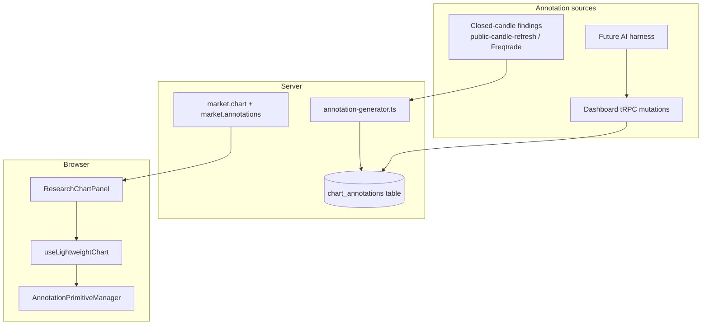

# Charting Platform Design — Agent-First Annotations on Lightweight Charts

**Status:** Draft for review  
**Date:** 2026-09-06  
**Aligns with:** [`docs/PRODUCT_VISION.md`](../../PRODUCT_VISION.md)  
**Skill reference:** `.agents/skills/lightweight-charts` (TradingView LWC v5)

## Summary

Build an **agent-first chart annotation platform** on the existing **Lightweight Charts 5.2** stack. The primary input path is **programmatic**: the signal engine, future AI harness, or dashboard API produce `ChartAnnotation` objects from methodology evidence; the chart renders them as **read-only LWC series primitives**. Manual drawing UX is deferred.

Signals-only boundary is unchanged: annotations are research evidence, not trade instructions.

## Goals

1. **Derive chart geometry from closed-candle findings** (Wyckoff spring/upthrust, SMC BOS, invalidation bands) automatically.
2. **Expose a stable annotation contract** (`shared/chart-types.ts`) consumable by agents and Telegram evidence payloads.
3. **Render annotations with LWC v5 primitives** (`ISeriesPrimitive`) attached to the candlestick series — no chart engine migration.
4. **Persist annotations** per asset/timeframe/candle-close with audit trail (dashboard-protected tRPC).
5. **Keep manual drawing out of MVP** — optional read-only inspect/select later.

## Non-goals (MVP)

- Full TradingView-style drawing toolbar (trendline click-to-draw, fib tools, undo stack).
- KLineChart / TradeCanvas engine migration.
- Live forming-candle overlay on chart (Phase 3 in product vision).
- AI harness worker (separate spec; consumes same annotation API).

## Decision record

| Decision | Choice | Rationale |
|---|---|---|
| Chart engine | **Stay on LWC 5.2** | Already integrated; official primitive API for overlays; Apache 2.0 |
| Primary UX | **Agent-first (C)** | Methodology rules already emit structured `evidence`; map to geometry before building manual tools |
| Extension mechanism | **`ISeriesPrimitive` on candlestick series** | Coordinate-aware; clips to price pane; supports trendlines/zones per LWC skill guidance |
| Scaffolding | **`npm create lwc-plugin@latest`** for each primitive type | Official pattern; copy from `plugin-examples/` |
| Time model | **`UTCTimestamp` seconds** | Matches existing `chartTimestamp()`; LWC foot-gun avoidance |
| Interaction MVP | **Read-only render** | Agent path does not need hit-testing; reduces scope vs full drawing controller |

## Architecture



### Data flow

1. On signal ingest or public refresh, **annotation generator** reads `SignalFinding[]` + candle context.
2. Generator emits zero or more `ChartAnnotation` records (deterministic IDs from finding + candle close).
3. Annotations persist in MySQL/PostgreSQL; returned by `market.annotations` and embedded in `market.chart` response.
4. `ResearchChartPanel` passes `annotations` to `useLightweightChart`.
5. `AnnotationPrimitiveManager` attaches/detaches LWC primitives when annotations or chart instance changes.

## Annotation model (extended)

Existing types in `shared/chart-types.ts` are the contract. Add:

```typescript
export type MethodologyOverlayAnnotation = ChartAnnotationBase & {
  kind: "METHODOLOGY_OVERLAY";
  ruleId: string;
  ruleFamily: string;
  direction: "BULLISH" | "BEARISH" | "NEUTRAL";
  sourceFindingId: string;
  overlayShape: "HORIZONTAL_LEVEL" | "TRENDLINE" | "ZONE";
  // Geometry fields mirror the shape kind (price, times, etc.)
  geometry: HorizontalLevelAnnotation | TrendlineAnnotation | ZoneAnnotation;
};

export type ChartAnnotationSource = "ENGINE" | "AGENT" | "DASHBOARD" | "SYSTEM";
```

`ChartAnnotation` union expands to include `MethodologyOverlayAnnotation` wrapping concrete geometry.

### Deterministic IDs

```
annotation-{sha256(assetSymbol + timeframe + candleCloseTime + ruleId + overlayShape)}
```

Enables idempotent upsert when the same finding is re-emitted on refresh.

## Evidence → geometry mapping (MVP rules)

Map **enabled methodology findings** from the latest closed candle:

| Rule ID | Annotation | Geometry |
|---|---|---|
| `WYCKOFF_SPRING_PROXY_V1` | Horizontal support + sweep zone | `HORIZONTAL_LEVEL` at `evidence.priorLow`; `ZONE` from sweep low to `priorLow` |
| `WYCKOFF_UPTHRUST_PROXY_V1` | Horizontal resistance + sweep zone | `HORIZONTAL_LEVEL` at `evidence.priorHigh`; `ZONE` from `priorHigh` to sweep high |
| `SMC_BULLISH_BOS_PROXY_V1` | Break level + extension trendline | `HORIZONTAL_LEVEL` at `evidence.priorHigh`; optional `TRENDLINE` along recent swing lows |
| `SMC_BEARISH_BOS_PROXY_V1` | Break level + extension trendline | `HORIZONTAL_LEVEL` at `evidence.priorLow` |
| `EMA_TREND_V1` | EMA structure band | `ZONE` between EMA20 and EMA50 for last N candles (research window) |
| Invalidation (from snapshot) | Invalidation band | `ZONE` from `close ± atr14` labeled `INVALIDATION` |

Pattern-only findings (Doji, Engulfing, etc.) **do not** generate geometry in MVP — they remain signal markers only.

Generator lives in `shared/annotation-generator.ts` (pure, testable, shared by server and tests).

## LWC rendering layer

Per `.agents/skills/lightweight-charts`:

- Use **`ISeriesPrimitive`** attached via `candlestickSeries.attachPrimitive(...)`.
- Implement one primitive class per shape family:
  - `HorizontalLevelPrimitive`
  - `TrendlinePrimitive`
  - `ZonePrimitive`
- Use `target.useBitmapCoordinateSpace` for crisp lines on HiDPI.
- Convert annotation times/prices with `series.priceToCoordinate` / `chart.timeScale().timeToCoordinate` inside `updateAllViews`.
- Call `requestUpdate` from primitive when annotation props change.
- **Do not** use `series.setMarkers` (v4); keep signal markers on `createSeriesMarkers` as today.

File layout:

```
components/charting/
  primitives/
    horizontal-level-primitive.ts
    trendline-primitive.ts
    zone-primitive.ts
    annotation-primitive-manager.ts
  use-lightweight-chart.ts          # attach manager after series creation
  research-chart-panel.tsx
shared/
  chart-types.ts
  annotation-generator.ts
server/
  chart-annotations.ts              # DB CRUD + generator hook on ingest
```

Scaffold primitives with:

```bash
npm create lwc-plugin@latest
# Select "Drawing Primitive" template; adapt to annotation-driven (no click handlers in MVP)
```

## API surface

### tRPC (dashboard-protected)

| Procedure | Purpose |
|---|---|
| `market.annotations.list` | `{ assetSymbol, timeframe, candleCloseTime? }` → `ChartAnnotation[]` |
| `market.annotations.upsert` | Agent/dashboard batch upsert (validated Zod schema) |
| `market.annotations.delete` | Remove by id (audit event) |
| `market.chart` (extend) | Include `annotations` array alongside candles/signals |

### Agent contract (future harness)

POST body shape mirrors `ChartAnnotation[]` with required `source: "AGENT"` and `sourceManifestId`. Same Zod schema as upsert. No new public unauthenticated endpoint.

## Persistence

New table `chart_annotations`:

| Column | Type | Notes |
|---|---|---|
| `id` | varchar PK | Deterministic hash |
| `asset_symbol` | varchar | |
| `timeframe` | varchar | |
| `candle_close_time` | datetime | Anchor candle |
| `kind` | varchar | Annotation kind |
| `source` | enum | ENGINE / AGENT / DASHBOARD / SYSTEM |
| `source_finding_id` | varchar nullable | Links to finding |
| `payload_json` | text | Full `ChartAnnotation` |
| `config_version` | int | Matches bot config |
| `created_at` | datetime | |

Non-destructive Drizzle migration; tests in `tests/chart-annotations.contract.test.ts`.

## UI behavior (MVP)

- `ResearchChartPanel` receives `annotations` from `market.chart`.
- Remove local-only "Add close as level" in controlled mode when server annotations present (or keep as draft-local until save — **decision: remove local level buttons when annotations API is wired** to avoid dual state).
- Legend adds methodology overlay colors (bullish/bearish/neutral).
- Tooltip/crosshair unchanged; optional future: highlight annotation under cursor via `subscribeClick` + hit-test.

## Visual language

| Element | Style |
|---|---|
| Bullish level/zone | `colors.success` at 60% opacity fill |
| Bearish level/zone | `colors.error` at 60% opacity fill |
| Neutral / invalidation | `colors.warning` dashed |
| Engine-sourced | Solid lines |
| Agent-sourced (future) | Dotted lines + `AGENT` label in primitive |

## Error handling

- Invalid geometry (time not in candle window) → skip annotation, log audit `ANNOTATION_SKIPPED`, do not fail chart render.
- Primitive attach failure → chart still shows candles; panel shows muted warning count.
- Generator throws → signal ingest succeeds; annotations omitted for that cycle.

## Testing

| Test | Scope |
|---|---|
| `shared/annotation-generator.test.ts` | Deterministic mapping from fixture findings |
| `tests/chart-annotations.contract.test.ts` | Zod + DB round-trip |
| `tests/charting-primitives.contract.test.ts` | Primitive classes export required LWC interfaces |
| `pnpm test:docker` | Full gate before merge |

## Phased delivery

### Phase 1 — Generator + render (this implementation plan)

- `annotation-generator.ts` for Wyckoff + SMC + invalidation
- LWC primitives + `AnnotationPrimitiveManager`
- Extend `market.chart` to include generated annotations (in-memory, no DB yet)

### Phase 2 — Persistence + ingest hook

- Drizzle schema + migration
- Upsert on signal ingest / public refresh
- `market.annotations.*` procedures

### Phase 3 — Agent API + harness prep

- Batch upsert from agent worker
- Telegram alert payload includes annotation summary (text, not image)

### Phase 4 — Manual drawing (deferred)

- Drawing toolbar, click-to-place, undo — only after agent path is stable

## Risks and mitigations

| Risk | Mitigation |
|---|---|
| Primitive performance with many zones | Cap annotations per chart window (e.g. 20); merge overlapping zones |
| Evidence schema drift | Generator reads typed evidence keys; contract tests per rule |
| LWC API confusion (v4 snippets) | Follow installed skill; grep `node_modules/lightweight-charts/dist/typings.d.ts` |
| RN Web DOM ref timing | Keep chart creation in `useEffect`; primitives attach after `setData` |

## Open questions (resolved for MVP)

| Question | Resolution |
|---|---|
| Engine vs KLineChart? | **LWC primitives** — user chose agent-first on current stack |
| Manual drawing priority? | **Deferred** — Phase 4 |
| Local level buttons? | **Remove when server annotations active** |

## References

- [LWC Plugins intro](https://tradingview.github.io/lightweight-charts/docs/plugins/intro)
- [LWC Series Primitives](https://tradingview.github.io/lightweight-charts/docs/plugins/series-primitives)
- [`server/public-candle-refresh.ts`](../../../server/public-candle-refresh.ts) — methodology evidence fields
- [`shared/chart-types.ts`](../../../shared/chart-types.ts) — annotation contract
- [`.agents/skills/lightweight-charts/SKILL.md`](../../../.agents/skills/lightweight-charts/SKILL.md)
